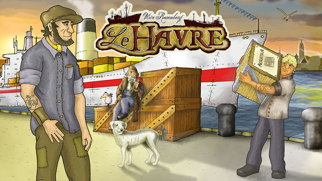

# Automated Le Havre Board Game Bot with Expert System AI (Using CLIPS)

# About

Experience Le Havre board game anew with our CLIPS-powered AI bot. Expert system integration drives strategic gameplay, adapting and learning with each move. Unveil the future of board games through our immersive, challenging, and innovative automated player. Outsmart AI or learn from its mastery!

This project implements a rule based expert system for the board game [Le-Havre](https://boardgamegeek.com/boardgame/35677/le-havre) as part of the Kowledge Engineering course @ uc3m. 

The problem is separated into two files, [ontology.clp](https://github.com/ricardograndecros/Expert-System-for-Le-Havre-board-game/blob/master/ontology.clp) represents the problem's domain, and [rules.clp](https://github.com/ricardograndecros/Expert-System-for-Le-Havre-board-game/blob/master/rules.clp) implements the game's mechanism and the expert's strategy. 

This project solves a simple solution and it's goal is to learn rule-based programming and understand how powerful this tools can be. The [documentation available](https://github.com/ricardograndecros/Expert-System-for-Le-Havre-board-game/blob/master/Le-Havre-Doc.pdf) is attached to the project, but it is only available in spanish. 

## Participants

David Álvarez Perales - [@DavisuaCoder](https://github.com/DavisuaCoder)  
Ricardo Prieto Álvarez
